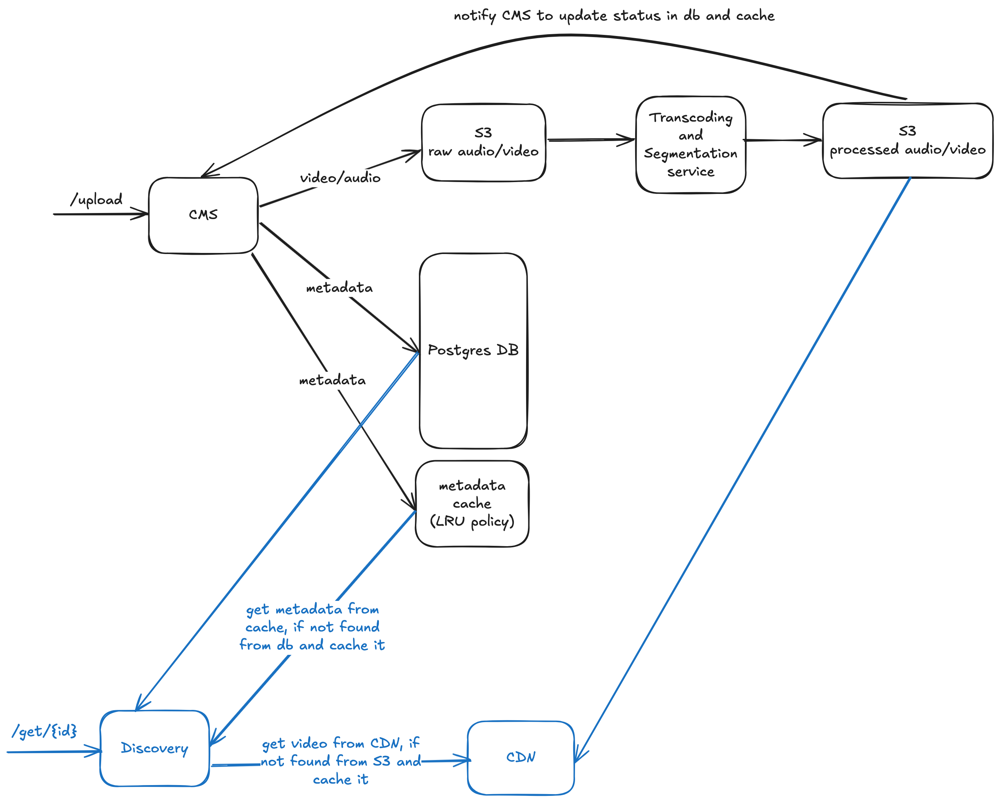
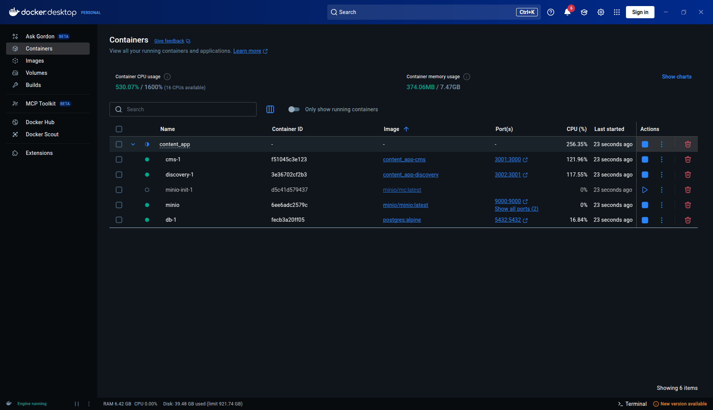
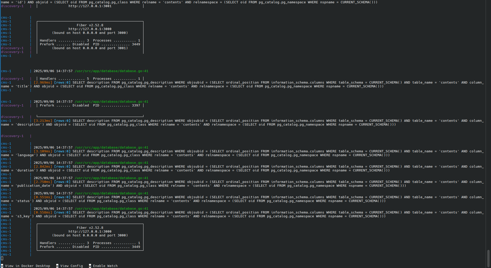
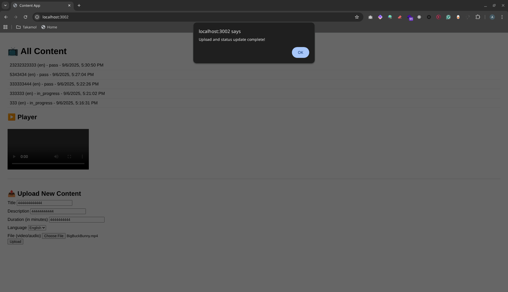
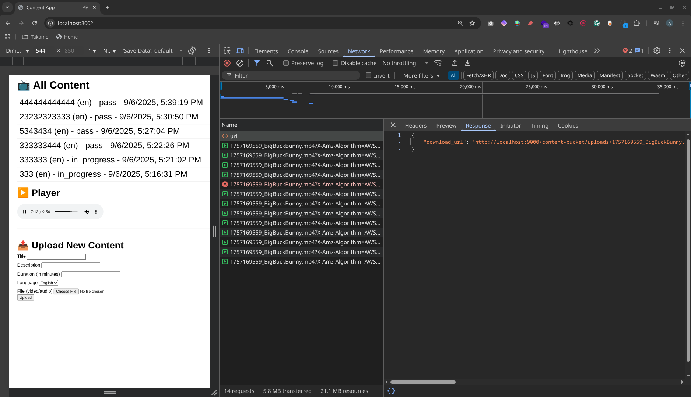
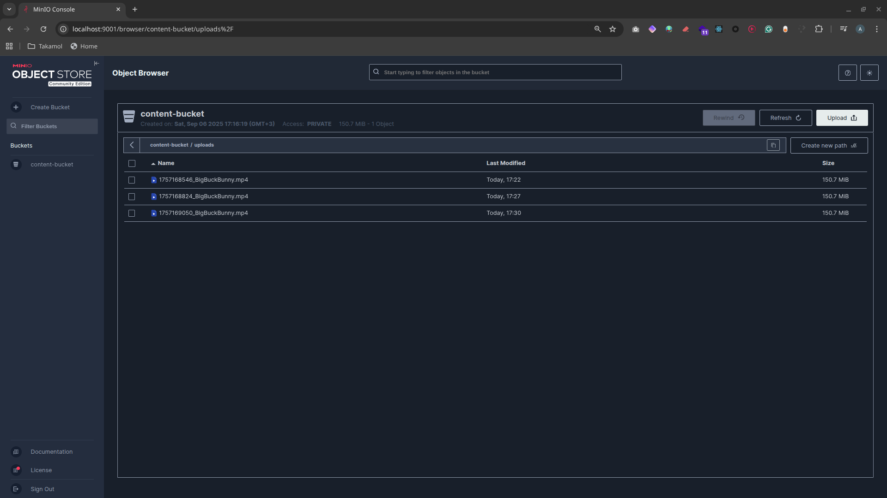
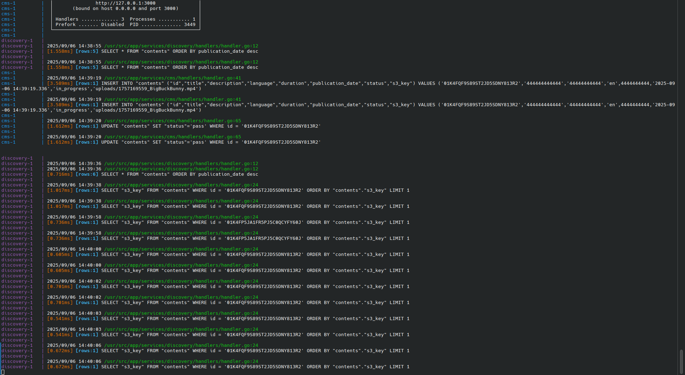

# Content App

REST APIs that can be used to upload and view video/audio contents, along with a simple UI page for local tests.

## How to run the app?
- Install docker
- Create a `.env` file based on `.env.example` and configure the following:
    1. `DB_USER` - Database username
    2. `DB_PASSWORD` - Database password  
    3. `DB_NAME` - Database name
    4. `MINIO_ROOT_USER` - MinIO root username
    5. `MINIO_ROOT_PASSWORD` - MinIO root password
    6. `MINIO_ENDPOINT` - MinIO endpoint (typically `http://minio:9000` for docker setup)
    7. `MINIO_BUCKET` - MinIO bucket name for storing content
- Run `docker compose up`
- The UI can be accessed from http://localhost:3001/ . After uploading the items, you can click on one of them using the list on the top of the page in order to see its content.
- Make sure to add `.env` file to `.gitignore` to not commit your creds.

## S3 Protocol

This application uses the S3 protocol for object storage. The S3 protocol is a widely adopted standard for object storage, originally developed by Amazon for their AWS S3 service.

For local development, we use MinIO, an open-source, high-performance object storage server that is fully compatible with the S3 protocol. This allows us to develop and test the application locally without relying on AWS.

Because the application is built on the S3 protocol, it can be easily configured to work with any S3-compatible service, including:
- Amazon S3
- Google Cloud Storage (with interoperability mode)
- DigitalOcean Spaces
- Oracle Cloud
- And many other cloud and on-premise storage solutions.

To switch to a different S3 provider, you only need to update the S3 endpoint and credentials in the `.env` file.

### MinIO Console

You can access the MinIO console at http://localhost:9001 to manage your buckets and objects.

### Logging

When you upload or fetch a video, the application will log the following information:
- A log entry indicating the start of the upload/fetch process.
- A log entry indicating the successful completion of the upload/fetch process.
- A log entry indicating any errors that may have occurred during the upload/fetch process.

## Architecture

*Caption: A diagram of the system architecture.*

## Screenshots

*Caption: The application's services running as Docker containers.*

*Caption: Application logs showing database queries and service information.*

*Caption: The web interface for uploading and viewing content. A success message is shown after an upload.*

*Caption: The browser's network tab showing requests made by the application, including the download URL for a video.*

*Caption: The MinIO console showing the uploaded video files in the content bucket.*

*Caption: Detailed application logs with SQL queries for content management.*

## Contributors

- Amal Meer
- Abdullah Alqahtani

## License

This project is licensed under the MIT License. Copyright (c) 2025 Amal Meer

# Project documentation
For more info, refer to [this page](https://www.notion.so/Content-Management-and-Discovery-Service-21b9bf2fee4a8017b6c5fe8fbfe46bfd?source=copy_link)